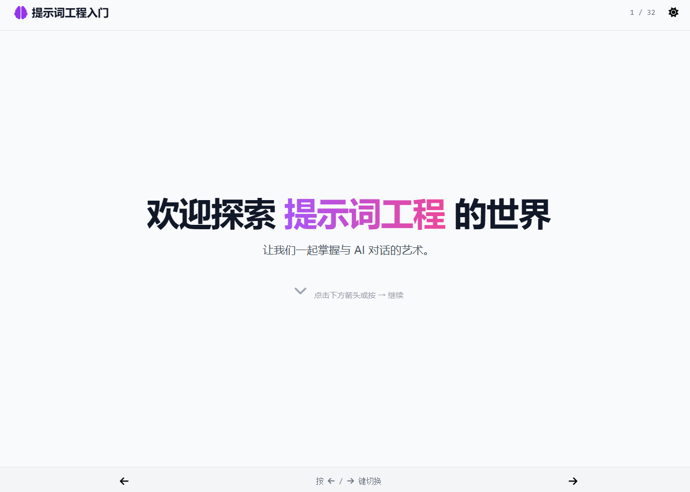

# Prompt Engineer
一个提示词工程入门的介绍材料，使用html模仿幻灯片进行演示。

提示词是目前快速实现某个单一目标的性价比最高的方式，所以目前写好提示词还是比较重要的。

使用gemini2.5 进行制作，本材料本身也是提示词工程的一个实践以及示例。

粗稿大纲构思2天左右。
使用ai ppt工具效果不是很好，正好遇到最近兴起的网页版风格介绍材料，针对该风格修改为使用左右切换，与幻灯片效果较为一致。

**相比于提示词工程的内容，这种网页版ppt的生成以及展示方式，更加契合AI生成，同时具备流畅的动画效果以及排版，个人认为是未来展示的发展方向**

[体验地址](https://sharmt1411.github.io/promptengineer/)
[体验地址2](https://prompt-sharmt.vercel.app/) 

